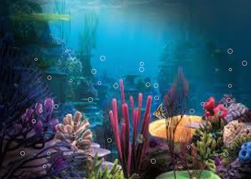
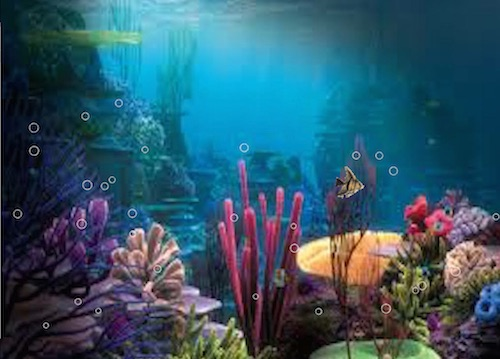

## Animation Scene
This project explores the use of animation, gifs, and classes. 

There are two fish gifs; one fish gif faces left and the other right. The arrow keys control the direction in which the fish moves. The left facing fish gif is always used unless the right arrow key is pressed, then the right facing fish gif is used, shown below: 

There are two vectors of bubbles using the bubble class. One vector has bubbles starting at the bottom of the screen and moving up. The other vector has bubbles coming out of the fish's mouth whenever the 'return' key is pressed.